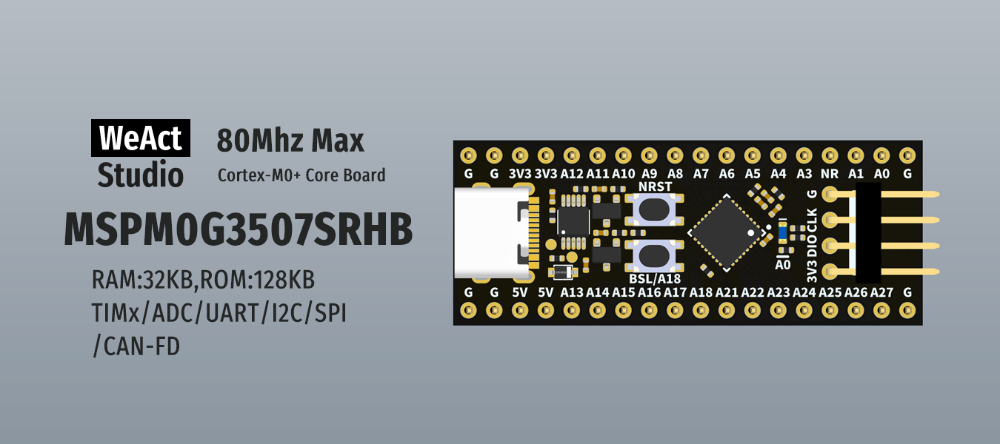

## Github Source

https://github.com/WeActStudio/WeActStudio.MSPM0G3507CoreBoard/

## Compiler

### CCStudio
This is the official IDE for TI products, the latest is based on the VSCode app

*Download url*: https://www.ti.com/tool/CCSTUDIO

#### Linux

The best way is to use the `.desktop` file to launch the app, the alternative is to run
`PATH_TO_INSTALL/ccs/theia/ccstudio`, but in any case it will fail with the following message:
```
AppImage: the setuid sandbox is not running as root
```

To fix it, you can run it as:
```shellscript
PATH_TO_INSTALL/ccs/theia/ccstudio --no-sandbox
```

You can also add the following `apparmor` profile under `/etc/apparmor.d/ccstudio`
```
abi <abi/4.0>,
include <tunables/global>
profile arduino PATH_TO_INSTALL/ccs/theia/ccstudio flags=(unconfined) {
  userns,
  include if exists <local/ccstudio>
}
```

And restart `apparmor`
```shellscript
sudo systemctl restart apparmor
```


::: tip
**Generating bin files**

For `PyOCD`, `.bin` files need to be generated instead of the default `.out` files, to do that:
1. Right click on *Project* and click *Properties*
2. *Tools* -> *Arm Hex Utility*
3. Enable checkbox *Enable 'Arm Hex Utility'*
4. Click on dropdown for *Arm Hex Utility*
5. Select *General Options*
6. Enable checkbox *Output as bytes rather than target addressing (--byte, -byte)*
7. Select *Output Format*
8. Select *Binary (--binary, -b)*

Alternative is to edit flags manually and add this:
```
--byte --diag_wrap=off --binary
```

:::

## Programmer

### PyOCD

[PyOCD](https://github.com/pyocd/pyocd) is supported, so any compatible programmer can be used.

I'm using the [WeAct MiniDebugger](https://github.com/WeActStudio/WeActStudio.MiniDebugger) to test it.

**Installing PyOCD**

(I use a virtual env, but a direct install can also be used)

```shellscript
python3 -m venv ~/pyocd
source ~/pyocd/bin/activate

pip install pyocd
```

**Install the MCU Pack**
```
pyocd pack install MSPM0G3507
```

**Checking the MCU**
```shellscript
pyocd cmd -t mspm0g3507 -v
```

*Output example*
```
0003433 I Target type is mspm0g3507 [board]
0003856 I DP IDR = 0x6ba02477 (v2 rev6) [dap]
0003895 I AHB-AP#0 IDR = 0x84770001 (AHB-AP var0 rev8) [discovery]
0003897 I AP#1 IDR = 0x002e0001 (AP var0 rev0) [discovery]
0003898 I AP#2 IDR = 0x002e0000 (AP var0 rev0) [discovery]
0003900 I AP#3 IDR = 0x002e0003 (AP var0 rev0) [discovery]
0003902 I AP#4 IDR = 0x002e0002 (AP var0 rev0) [discovery]
0003921 I AHB-AP#0 Class 0x1 ROM table #0 @ 0xf0000000 (designer=43b:Arm part=4c1) [rom_table]
0003942 I [0]<e00ff000:ROM class=1 designer=43b:Arm part=4c0> [rom_table]
0003942 I   AHB-AP#0 Class 0x1 ROM table #1 @ 0xe00ff000 (designer=43b:Arm part=4c0) [rom_table]
0003966 I   [0]<e000e000:SCS v6-M class=14 designer=43b:Arm part=008> [rom_table]
0003978 I   [1]<e0001000:DWT v6-M class=14 designer=43b:Arm part=00a> [rom_table]
0003990 I   [2]<e0002000:BPU v6-M class=14 designer=43b:Arm part=00b> [rom_table]
0004008 I [2]<140402000:MTB M0+ class=9 designer=43b:Arm part=932 devtype=31 archid=0a31 devid=0:0:0> [rom_table]
0004019 I CPU core #0: Cortex-M0+ r0p1, v6.0-M architecture [cortex_m]
0004019 I   Extensions: [MPU] [cortex_m]
0004025 I 2 hardware watchpoints [dwt]
0004030 I 4 hardware breakpoints, 0 literal comparators [fpb]
```

**Flash file**
```shellscript
pyocd flash -t mspm0g3507 hello-blinky.bin
```

::: tip
**BSL / "Unbrick"**

Sometimes the MCU can fail to program and it will be "bricked", the easy solution is to start in BSL mode and run the flash command **before 10 seconds**
To enter into BSL you need to:
1. Keep pressed on **BSL/A18** button
2. Press **NRST** button
3. Release **NRST** button
4. Release **BSL/A18** button

There is no other indication about entering this mode, so after the sequence, run the **Flash command**
:::

## Hello World Example

### CCStudio

The example at: https://github.com/WeActStudio/WeActStudio.MSPM0G3507CoreBoard/tree/master/Examples/gpio_blink cannot
be imported in new versions of CCStudio so the alternative is:
1. *File* -> *Create New Project*
2. *Device and Board* write `MSPM0G3507` select the item under `Device`
3. Select `empty_cpp` as *Project File Name*
4. Click on *Import*
5. Select *CCS - TI Arm Clang Compiler*
6. *Next*
7. *Project Name* `gpio_blink`
8. *Next*

The first time it will take some time to download the proper toolchain

9. Right click over `empty_cpp.syscfg` -> *Open with..* -> *Text Editor*
10. Copy code from: https://github.com/WeActStudio/WeActStudio.MSPM0G3507CoreBoard/blob/master/Examples/gpio_blink/gpio_blink.syscfg
11. Double click over `empty_cpp.cpp`
12. Copy code from: https://github.com/WeActStudio/WeActStudio.MSPM0G3507CoreBoard/blob/master/Examples/gpio_blink/gpio_blink.c
13. *Project* -> *Build Projects* (or `Ctrl+b`)
14. Refer to **Generating bin files** section

The example will start blinking the built-in LED every 4 seconds. If you press the `BSL/A18` button then it will blink
4x faster, or every second.