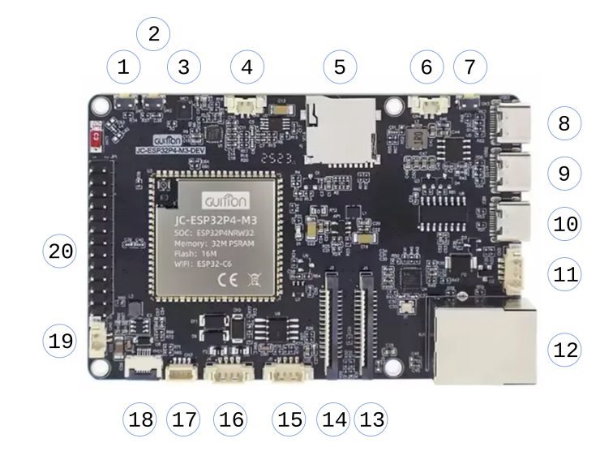
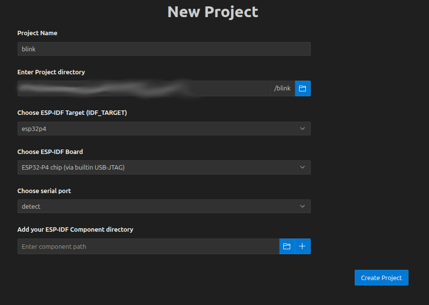
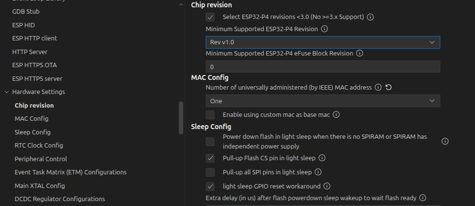
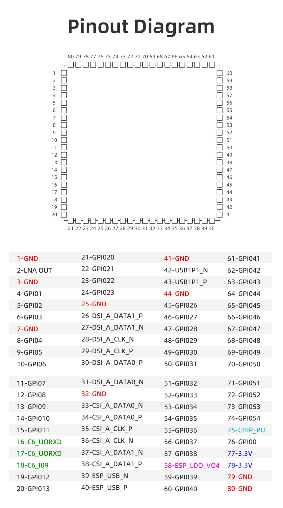

# Guition JC-ESP32P4-M3-DEV

This board features a Guition `JC-ESP32P4-M3`, which is a module
that includes an ESP32-P4 and an ESP32-C6 as a co-processor for
WIFI/Bluetooth.

## Links
* [Official Sales Page](https://www.guition.com/esp32p4-display-module/esp32p4-display-module)
* [Board Description](https://www.guition.com/icms/upload/fb081940d6fc11f09850077a33e1404f/file/productmanager-productfile/8e23ff8b670e435fa919fbe6ab2f0cb5/Directory/JC-ESP32P4-M3-DEV%20Specifications-EN_1776046921880.pdf)
* [ESP32-P4 Datasheet](https://documentation.espressif.com/esp32-p4-chip-revision-v1.3_datasheet_en.pdf)
* [ESP32-P4 Technical Reference](https://documentation.espressif.com/esp32-p4-chip-revision-v1.3_technical_reference_manual_en.pdf)
* [ESP32-C6 Datasheet](https://documentation.espressif.com/esp32-c6_datasheet_en.pdf)
* [ESP32-C6 Technical Reference](https://documentation.espressif.com/esp32-c6_technical_reference_manual_en.pdf)

## Github Repos
* https://github.com/DRubioG/JC-ESP32P4-M3-DEV (Unofficial Schematics)
* https://github.com/p1ngb4ck/unofficial_guition_esp32p4_repo/tree/main/JC-ESP32P4-M3-Dev (Unofficial Schematics with other documents)

## Board Connectors

| Symbol |   Description |
| -----: | :-----------: |
|  1     | **BOOT**  (*SW1*) - Boot Mode/`GPIO35` |
|  2     | **RESET** (*SW2*) - `CHIP_PU` |
|  3     | Microphone (*MIC1*) |
|  4     | Speaker (*CN1*) |
|  5     | microSD Card Reader (*J1*) |
|  6     | Battery Connector (*CN4*)|
|  7     | Battery Start Charging (*SW3*) |
|  8     | USB High Speed (*USB3*) |
|  9     | USB Full Speed (*USB2*) |
| 10     | USB TTL/UART (*USB1*) |
| 11     | MX1.25 4P Power Input (*CN2*) |
| 12     | Ethernet (*RJ1*) |
| 13     | Camera CSI (*J3*) |
| 14     | Display DSI (*J2*) |
| 15     | MX1.25 4P RS485/RS422 Input (*J5*) |
| 16     | MX1.25 4P RS485/RS422 Driver Output (*J4*) |
| 17     | JST SH1.0 4P I2C (*CN3*) |
| 18     | FPC Capacitive Touch 6pin 0.5mm (*FPC1*) |
| 19     | Backlight LED Output (*CN5*) |
| 20     | Expansion IO (*JP1*) |


## Inputs and Connectors

### Microphone
`MIC1` connects to [ES8311](http://www.everest-semi.com/pdf/ES8311%20PB.pdf)
(DAC chip)

### Speaker
DAC Chip is connected to
[NS4150](https://aitendo3.sakura.ne.jp/aitendo_data/product_img/ic/power_amp/NS4150/NS4150.pdf)
(Audio Amplifier), which can be enabled by setting `GPIO11` to `HIGH`.


### DAC Chip
Controlled with `I2C` using `GPIO7` (`SDA`) and `GPIO8` (`SCL`) and an
address of `0x18`.


### microSD Card Reader

### MX1.25 Power Input (`CN2`)
`CN2` is a 4-pin Power Input and UART, pins:
| PIN | Description |
| --: | ----------- |
|  1  | 5V Power |
|  2  | UART TX (`GPIO37`) |
|  3  | UART RX (`GPIO38`) |
|  4  | GND |

### Ethernet

### JST SH1.0mm 4P I2C (`CN3`)

4 Pin interface for I2C Communication
| PIN | Description |
| --: | ----------- |
|  1  | GND |
|  2  | 3.3V Power |
|  3  | `SCL` (`GPIO8`) |
|  4  | `SDA` (`GPIO7`) |

### MX1.25 4P RS485/RS422 (`J5` Input, `J4` Output)

Uses a [MAX485](https://www.analog.com/media/en/technical-documentation/data-sheets/MAX1487-MAX491.pdf) to handle input and send output

**Input** (`J5`)
| PIN | Description |
| --: | ----------- |
|  1  | 5V Power |
|  2  | `R` Receiver Output |
|  3  | `D` Driver Input |
|  4  | GND |

**Output** (`J4`)
| PIN | Description |
| --: | ----------- |
|  1  | 5V Power |
|  2  | `A` Noninverting Driver Output |
|  3  | `B` Inverting Driver Output |
|  4  | GND |

To enable it, UART must be used through `GPIO27` (`RX`/`R`) and
`GPIO26` (`TX`/`D`).

### Backlight LED Output (`CN5`)
It uses an [MP3202](https://www.monolithicpower.com/en/documentview/productdocument/index/version/2/document_type/Datasheet/lang/en/sku/MP3202/document_id/1495/) to power up to 39 white LEDs.

To enable the chip, `GPIO23` must be used.

| PIN | Description |
| --: | ----------- |
|  1  | Top / Cathode |
|  2  | Bottom / Anode |
|  3  | GND |
|  4  | GND |

### FPC Capacitive Touch 6pin 0.5mm (`FPC1`)

| PIN | Description |
| --: | ----------- |
|  1  | 3.3V Power |
|  2  | GND |
|  3  | SDA (`GPIO7`) |
|  4  | SCL (`GPIO8`) |
|  5  | INT |
|  6  | RST |

### Expansion IO (`JP1`)
| PIN | Description |
| --: | ----------- |
|  1  | 3.3V Power |
|  2  | 5V Power |
|  3  | 3.3V Power |
|  4  | 5V Power |
|  5  | GND |
|  6  | GND |
|  7  | `GPIO1` |
|  8  | NC |
|  9  | `GPIO2` |
| 10  | `GPIO47`|
| 11  | `GPIO3` |
| 12  | `GPIO46`|
| 13  | `GPIO4` |
| 14  | `GPIO45`|
| 15  | `GPIO5` |
| 16  | GND |
| 17  | `GPIO20`|
| 18  | 3.3V Power |
| 19  | `GPIO32`|
| 20  | `C6_U0RXD` (C6 `RX`)|
| 21  | `GPIO33`|
| 22  | `C6_U0TXD` (C6 `TX`)|
| 23  | `SDA`|
| 24  | `C6_IO9` (C6 `BOOT`)|
| 25  | `SCL`|
| 26  | `C6_CHIP_PU` (C6 `RESET`)|


## Setup
* [Install ESP32-IDF](https://docs.espressif.com/projects/esp-idf/en/stable/esp32/get-started/index.html)

### VSCode

* [Install Extension](https://marketplace.visualstudio.com/items?itemName=espressif.esp-idf-extension)
* Select `ESP-IDF: Explorer` sidebar
* `Advanced -> New Project Wizard`
* Select SDK Version
* `ESP-IDF Templates -> sample_project` click on button `Create project using template sample_project` and select location

* Select Command `SDK Configuration Editor (menuconfig)`
* Select `Component config -> Hardware Settings -> Chip Revision`
* Check `Select ESP32-P4 revisions <3.0 (No >=3.x Support)`
* `Minimum Supported ESP32-P4 Revision` select `Rev v1.0`

* `Build Project`
* `Flash Device` select `UART`

The led (with resistance) should be connected to
`GND` (`JP1` Pin 5) and `GPIO1` (`JP1` Pin 7) and
should blink each second.

`main/main.c`
```c
#include <stdio.h>
#include "freertos/FreeRTOS.h"
#include "freertos/task.h"
#include "driver/gpio.h"
#include "esp_log.h"

#define BLINK_GPIO GPIO_NUM_1
#define BLINK_PERIOD 1000

static const char *TAG = "blink";
static uint8_t s_led_state = 0;

static void blink_led(void)
{
    /* Set the GPIO level according to the state (LOW or HIGH)*/
    gpio_set_level(BLINK_GPIO, s_led_state);
}

static void configure_led(void)
{
    ESP_LOGI(TAG, "Example configured to blink GPIO LED!");
    gpio_reset_pin(BLINK_GPIO);
    /* Set the GPIO as a push/pull output */
    gpio_set_direction(BLINK_GPIO, GPIO_MODE_OUTPUT);
}

void app_main(void)
{
    /* Configure the peripheral according to the LED type */
    configure_led();

    while (1) {
        ESP_LOGI(TAG, "Turning the LED %s!", s_led_state == true ? "ON" : "OFF");
        blink_led();
        /* Toggle the LED state */
        s_led_state = !s_led_state;
        vTaskDelay(BLINK_PERIOD / portTICK_PERIOD_MS);
    }
}
```

## Module Pinout
